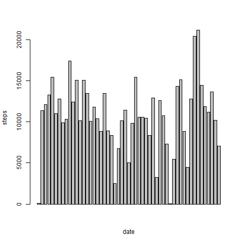
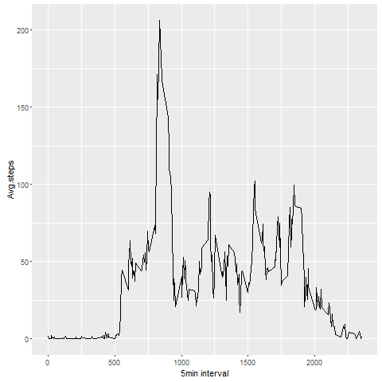
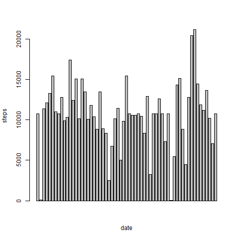
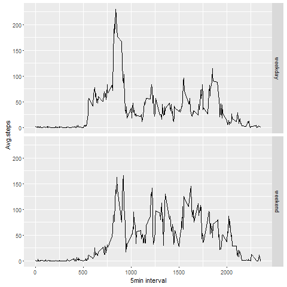

## Loading and preprocessing the data
```
activity<-read.csv("activity.csv")
```

## What is mean total number of steps taken per day?

Histogram
```
daysteps<-aggregate(steps~date, data=activity, FUN=sum)
 barplot(daysteps$steps, xlab="date",ylab="steps")
```
 

Mean
```
mean(daysteps$steps)
[1] 10766.19
```

Median
```
median(daysteps$steps)
[1] 10765
```

## What is the average daily activity pattern?

```
library(ggplot2)
interval<-aggregate(steps~interval, data=activity,FUN=mean)
ggplot(data=interval, aes(x=interval, y=steps))+geom_line()+xlab("5min interval")+ylab("Avg.steps")
```
 
Which one contains the max number of steps
```
interval$interval[which.max(interval$steps)]
[1] 835
```


## Imputing missing values

find missing values
```
sum(is.na(activity))
[1] 2304
```
fill missing values with mean value
```
activity<-merge(activity, interval, by="interval", suffixes=c("",".y"))
na<-is.na(activity$steps)
activity$steps[na]<-activity$steps.y[na]
activity<-activity[,c(1:3)]
```
New histogram about the new dataset
```
daysteps<-aggregate(steps~date, data=activity, FUN=sum)
barplot(daysteps$steps, xlab="date",ylab="steps")
```
 
Mean
```
mean(daysteps$steps)
10766.19
```

Median
```
median(daysteps$steps)
10766.19
```
Conclusion: mean are the same, median increased a little bit.

## Are there differences in activity patterns between weekdays and weekends?

Create a new factor variable in the dataset with two levels – “weekday” and “weekend” 
```
head(activity)
new_datetype<-function(date){if(weekdays(as.Date(date))%in% c("Saturday","Sunday")){"weekend"}else{"weekday"}}
activity$new_datetype<-as.factor(sapply(activity$date,new_datetype)）
head(activity)
```

plot - compare weekend and weekday
```
> new_average<-aggregate(steps~interval+new_datetype, data=activity, mean)
> ggplot(new_average,aes(interval,steps))+geom_line()+facet_grid(new_datetype~.)+xlab("5min interval")+ylab("Avg.steps")
```
 
